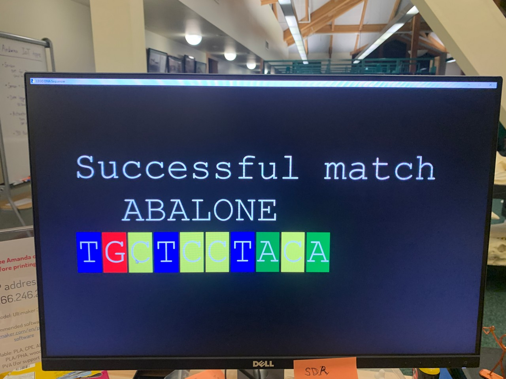

# LEGO DNA Sequencer and DIY Construction

# Table of Contents
  
&emsp;[Overview](#overview)  
&emsp;[Documentation](#documentation)  
&emsp;&emsp;[LEGO DNA Sequencer and DIY Construction](Documentation/LEGO%20DNA%20Sequencer%20and%20DIY%20Construction.pdf)
&emsp;&emsp;[LEGO DNA Sequencer User Manual](Documentation/LEGO%20DNA%20Sequencer%20User%20Manual.pdf)
&emsp;[Arduino Breadboard](#arduino-breadboard)  
&emsp;[Arduino Schematic](#arduino-schematic)  
&emsp;[Python Remote LCD](#python-remote-lcd)  

## Overview
The purpose of this LEGO DNA Sequencer and DIY Construction is to provide a complete blueprint for an open source tool that can be used to explain the complex DNA sequencing operation with a colorful easy to understand model.

 ## Documentation
 The documentation for the LEGO DNA Sequencer includes a complete PDF with the DIY and also a separate extracted User Manual.

[LEGO DNA Sequencer and DIY Construction](Documentation/LEGO%20DNA%20Sequencer%20and%20DIY%20Construction.pdf)

[LEGO DNA Sequencer User Manual](Documentation/LEGO%20DNA%20Sequencer%20User%20Manual.pdf)

## Arduino Breadboard

## Arduino Schematic

## Python Remote LCD

In a classroom setting for demonstrating the LEGO DNA Sequencer this Python code will emulate the LCD on a large screen.

[RemoteLCD PySimpleGUI Version](Python%20Remote%20LCD/RemoteLCD_PySimpleGUI.py)

[RemoteLCD tkinter Version](Python%20Remote%20LCD/RemoteLCD_tkinter.py)